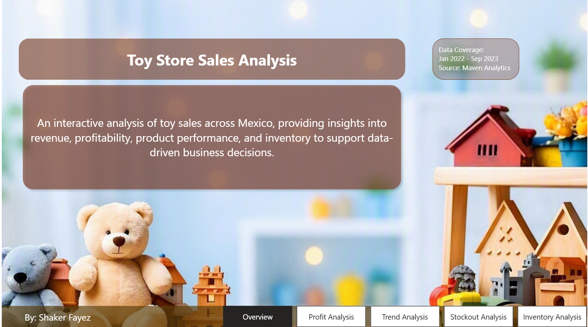
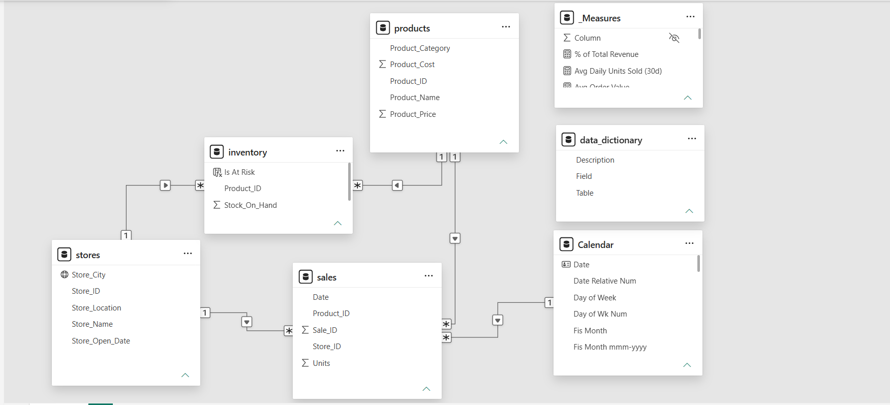
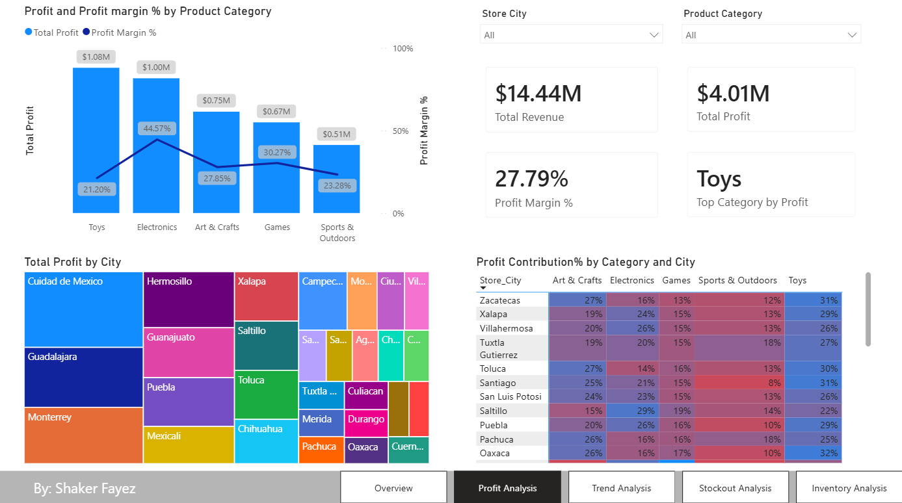
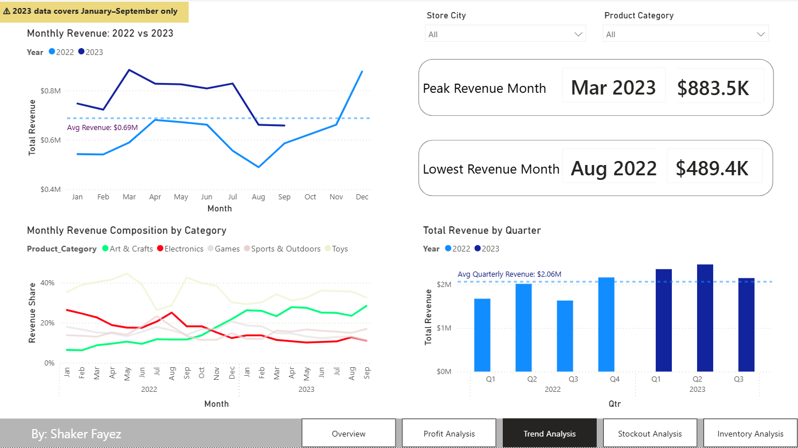
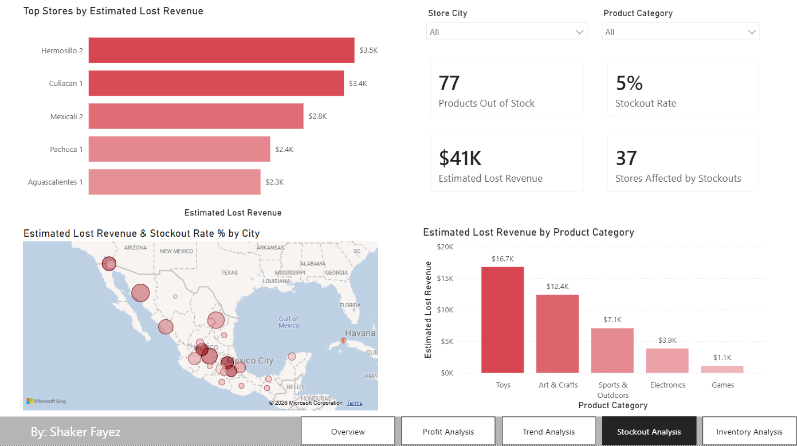
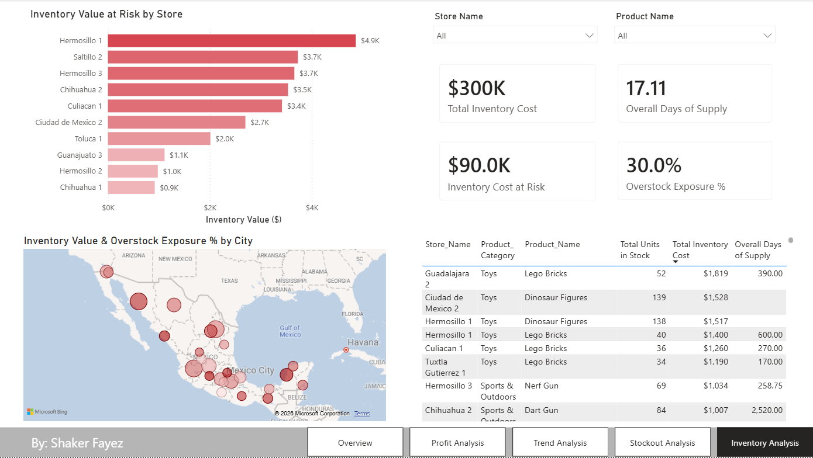

# Toy Store Sales Analysis — Power BI Report

## 🔗 **[View the live interactive report](https://app.powerbi.com/view?r=eyJrIjoiMWI2MWU3MDMtMjBhMi00YWZmLTgxZTQtOTFlOTMzODc0YTI2IiwidCI6IjM5MDI1NWU4LTdjYTUtNDk2NS1iZDQ4LWU4MGY4MDA0MTFkZCJ9&pageName=f405f97f146cd1e19175)** — no sign-in required

An interactive Power BI analysis of a fictitious Mexican toy store chain's sales, profitability, stockout, and inventory data, built as part of the [Maven Analytics Mexico Toy Sales Challenge](https://mavenanalytics.io/).

**By:** Shaker Fayez

---

## 📌 Project Overview

Maven Toys is a fictitious toy store chain operating across Mexico. This report analyzes sales, inventory, and store-level data to answer four core business questions posed by stakeholders, covering profitability, seasonal trends, stockout impact, and inventory risk.

**Data Coverage:** January 2022 – September 2023
**Source:** Maven Analytics (Public Domain)
**Tables:** `products`, `stores`, `sales`, `inventory`, `Calendar`


<!-- Placeholder: Overview / landing page screenshot -->

---

## ❓ Business Questions Addressed

This report is structured as one page per stakeholder question:

1. **Which product categories drive the biggest profits? Is this consistent across store locations?**
2. **Can we find any seasonal trends or patterns in the sales data?**
3. **Are we losing sales due to products being out of stock at certain locations?**
4. **How much money is tied up in inventory at the toy stores? How long will it last?**

---

## 🗂️ Data Model

The model is a star schema built around a central `sales` fact table, related to `products`, `stores`, and a `Calendar` date table. A separate `inventory` table tracks current stock levels per Product × Store combination.

**Key modeling consideration:** `inventory` is a **point-in-time snapshot** — it has no date dimension. This means the report cannot know *when* historically a stockout occurred or *how long* it lasted; it can only observe current stock levels and infer risk/impact using recent sales velocity. This constraint directly shaped the design of the lost-sales and overstock-risk measures below.




---

## 🧮 Key DAX Measures

A few measures worth highlighting for the reasoning behind them, not just the syntax:

### `Avg Daily Units Sold (30d)`
Computes a trailing 30-day sales rate per Product × Store, anchored to the last actual sale date in the dataset (rather than `TODAY()`, since this is historical data). This rate underpins every downstream estimate in the Stockout and Inventory pages.

### `Est Lost Sales (Revenue)`
Estimates revenue lost to stockouts by projecting the 30-day sales rate forward for products currently at zero stock. Explicitly labeled as an estimate in the report, since inventory has no date field to confirm exactly how long a stockout has lasted.

### `Inventory Cost at Risk`
Flags a Product × Store row as "at risk" if it has stock on hand **and** either (a) no reliable recent sales rate, or (b) a projected days-of-supply figure exceeding 90 days:

```dax
Inventory Cost at Risk =
SUMX(
    FILTER(
        inventory,
        VAR ProductID = inventory[Product_ID]
        VAR StoreID = inventory[Store_ID]
        VAR Stock = inventory[Stock_On_Hand]
        VAR DailyRate =
            CALCULATE(
                [Avg Daily Units Sold (30d)],
                sales[Product_ID] = ProductID,
                sales[Store_ID] = StoreID
            )
        VAR DaysOfSupply = DIVIDE(Stock, DailyRate)
        RETURN
            Stock > 0
                && ( COALESCE(DailyRate, 0) = 0 || DaysOfSupply > 90 )
    ),
    inventory[Stock_On_Hand] * RELATED(products[Product_Cost])
)
```

This single condition intentionally unifies two distinct data-quality blind spots discovered during validation:
- **Silent zero-sales products** — items with stock but no recent sales at all (rate is blank, easy to accidentally exclude from risk calculations)
- **Sparse-sales noise** — items with a technically non-zero rate based on just 1–2 sales in the window, which can produce wildly unreliable "days of supply" projections (seen as high as 2,500+ days in testing)

Both cases are treated as genuine risk rather than excluded or hidden, which is the more honest read of the underlying business reality.

---

## 📊 Report Pages & Key Findings

### 1. Profit Analysis
*Which categories drive the most profit, and is this consistent across locations?*


<!-- Placeholder: Profit Analysis page screenshot -->

- **Toys** generates the highest total profit chain-wide, while **Electronics** carries the strongest profit margin (~44.6%).
- Category mix varies meaningfully by city — some locations over-index heavily on a single category, revealing that a single chain-wide strategy may not fit every store.

### 2. Trend Analysis
*Are there seasonal trends or patterns in the sales data?*


<!-- Placeholder: Trend Analysis page screenshot -->

- Clear seasonality: revenue consistently peaks around Q2 and the Nov–Dec holiday period, with a low point in August 2022.
- A deeper cut of category share over time reveals a significant mix shift: **Art & Crafts** grew from roughly 7% to 26% of monthly revenue between 2022 and 2023, while **Electronics** roughly halved its share over the same period — a substantive change in what customers are buying, not just seasonal volume.

### 3. Stockout Analysis
*Are we losing sales due to stockouts, and is this concentrated at certain locations?*


<!-- Placeholder: Stockout Analysis page screenshot -->

- An estimated **$41K** in lost revenue across 77 out-of-stock Product × Store combinations (a 5% stockout rate), affecting 37 stores.
- Lost revenue is heavily concentrated in **Toys** ($16.7K) and **Art & Crafts** ($12.4K), with Hermosillo and Culiacán locations showing the highest individual store impact.

### 4. Inventory Analysis
*How much money is tied up in inventory, and how long will it last?*


<!-- Placeholder: Inventory Analysis page screenshot -->

- **$300K** in total inventory value (at cost), with an overall chain-wide supply of **17.1 days** at current sell-through pace.
- **$90K (30%)** of that inventory value is classified as at-risk of overstock — capital sitting idle in slow-moving or non-selling stock, concentrated in the Toys category and specific stores (e.g., Guadalajara 2's Lego Bricks stock represents ~390 days of supply).

---

## ⚠️ Known Limitations

Transparency about what this analysis can and can't confidently say:

- **Inventory is a snapshot, not a history.** The `inventory` table has no date field, so exact stockout duration and historical overstock trends cannot be determined — only current-state risk can be inferred.
- **30-day sales window sensitivity.** Lost-sales and days-of-supply estimates depend on a trailing 30-day sales rate. Products with very few sales in that window (1–2 units) can produce statistically unreliable projections; this is explicitly flagged and included as risk rather than hidden, per the `Inventory Cost at Risk` logic above.
- **2023 data is partial.** The dataset covers January–September 2023 only; year-over-year comparisons account for this but full-year 2023 totals are not available.
- **Geocoding.** City-level map visuals rely on Power BI/Azure Maps' automatic geocoding of city names; results were manually verified against known Mexican geography during development.

---

## 🛠️ Tools & Skills Demonstrated

- **Power BI Desktop** — data modeling, report design, Azure Maps integration
- **DAX** — row-context iteration (`SUMX`, `AVERAGEX`), `CALCULATE`/`FILTER` patterns, handling of blank/sparse-data edge cases
- **Data validation** — manual row-level spot-checks, aggregation-trap detection (average-of-ratios vs. ratio-of-averages), cross-measure reconciliation
- **Report/UX design** — consistent page templates, KPI card design, conditional formatting, slicer-driven interactivity

---

*Dataset provided by [Maven Analytics](https://mavenanalytics.io/) under Public Domain license. This is a fictitious dataset created for analytical practice purposes.*
